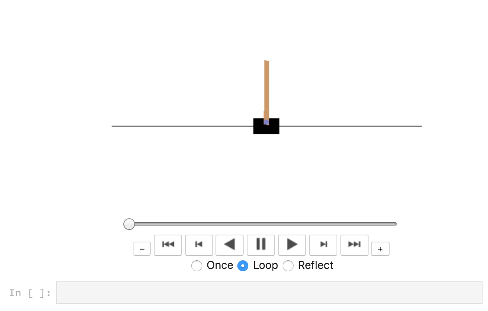

# deep-q-learning

Introduction to Making a Simple Game AI with Deep Reinforcement Learning


Minimal and Simple Deep Q Learning Implemenation in Keras and Gym. Under 100 lines of code!

The explanation for the `dqn.py` code is covered in the blog article
[https://keon.io/deep-q-learning/](https://keon.io/deep-q-learning/)


I made minor tweaks to this repository such as `load` and `save` functions for convenience.

I also made the `memory` a deque instead of just a list.
This is in order to limit the maximum number of elements in the memory.


The training might be unstable for `dqn.py`. This problem is mitigated in `ddqn.py`.
I'll cover `ddqn` in the next article.


## Docker Image

```sh
docker pull wqael/deep-q-learning
```

```sh
docker run -it -p 8888:8888 -p 6006:6006 -v ~/github/deep-q-learning:/notebooks wqael/deep-q-learning
```


## Rendering of OpenAI Gym in Jupyter

Notebook: [render_gym.ipynb](render_gym.ipynb)


